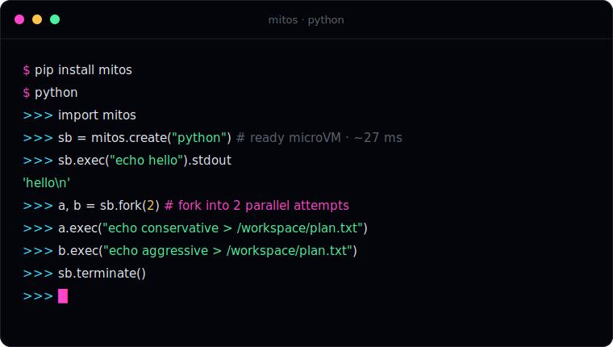

<p align="center">
  <picture>
    <source media="(prefers-color-scheme: dark)" srcset="assets/mitos-mark-white.svg">
    <source media="(prefers-color-scheme: light)" srcset="assets/mitos-mark-black.svg">
    
  </picture>
</p>

<h1 align="center">mitos</h1>

<p align="center">
  <b>Isolated, forkable computers for your AI agents.</b><br/>
  Millisecond microVM sandbox forking on Kubernetes.
</p>

<p align="center">
  <a href="https://mitos.run">Website</a> &nbsp;·&nbsp;
  <a href="https://github.com/mitos-run/mitos">Core repo</a> &nbsp;·&nbsp;
  <a href="https://github.com/mitos-run/mitos/blob/main/docs/quickstart.md">Quickstart</a> &nbsp;·&nbsp;
  <a href="https://github.com/mitos-run/mitos/discussions">Discussions</a>
</p>

<p align="center">
  
</p>

### Try it in a few lines

```python
import mitos

sb = mitos.create("python")              # Ready microVM sandbox (~27 ms warm-claim)
print(sb.exec("echo hello").stdout)      # hello

# Fork into independent siblings to try two approaches at once.
a, b = sb.fork(2)
a.exec("echo conservative > /workspace/plan.txt")
b.exec("echo aggressive  > /workspace/plan.txt")

sb.terminate()
```

> Set `MITOS_API_KEY` from [mitos.run](https://mitos.run). The base URL defaults
> to the hosted endpoint, so **no Kubernetes required**. The same code runs
> against a self-hosted cluster by setting `MITOS_BASE_URL`.

## Why mitos

- **⑂ Live-fork a _running_ VM.** N-way copy-on-write fork of a live microVM:
  daughters share the parent's memory pages until they write, so each fork lands
  in a warm, ready environment. Branch one agent into many parallel attempts.
- **⚡ ~27 ms warm-claim activate.** Firecracker microVMs restore from a memory
  snapshot in the tens-of-milliseconds class. P50 ~27 ms on the bare-metal
  reference node, reproducible from a script in the repo.
- **◎ Open-source, self-hostable, Kubernetes-native.** As far as we know, the
  only runtime that does all three. Run it hosted, or on your own KVM cluster
  where your data never leaves your infrastructure.

## Two ways to run

<table>
<tr>
<td width="50%" valign="top">

### ☁️ Hosted

A key and the SDK. No infrastructure to manage.

```bash
pip install mitos
export MITOS_API_KEY=sk-...
```

**→ [Get an API key](https://mitos.run)**

</td>
<td width="50%" valign="top">

### 🖥️ Self-host

Any Kubernetes cluster with KVM nodes. Your data never leaves your infra. Bare
metal (Hetzner + Talos) is a first-class target.

**→ [Self-host on Kubernetes](https://github.com/mitos-run/mitos/blob/main/docs/install.md)**

</td>
</tr>
</table>

## Project status

<p>
  <a href="https://github.com/mitos-run/mitos/releases"></a>
  <a href="https://github.com/mitos-run/mitos/actions/workflows/ci.yaml"></a>
  <a href="https://goreportcard.com/report/mitos.run/mitos"></a>
  
  <a href="https://github.com/mitos-run/mitos/blob/main/LICENSE"></a>
  <a href="https://github.com/mitos-run/mitos"></a>
</p>

## Fast, and we show our work


P50 ~27 ms warm-claim activate (snapshot load + fork-correctness handshake +
guest-ready) on the bare-metal reference node, reproducible from
[`bench/husk-activate-latency.sh`](https://github.com/mitos-run/mitos/blob/main/bench/husk-activate-latency.sh).
Full methodology in [BENCHMARKS.md](https://github.com/mitos-run/mitos/blob/main/BENCHMARKS.md).

## Explore

- **[mitos-run/mitos](https://github.com/mitos-run/mitos)**: the core runtime, SDKs (Python · TypeScript · Go), and `mitos.run` CRDs.
- **[Quickstart](https://github.com/mitos-run/mitos/blob/main/docs/quickstart.md)**: from `pip install` to a forked swarm of subagents.
- **[Migrating from E2B](https://github.com/mitos-run/mitos/blob/main/docs/migrating-from-e2b.md)**: drop-in path for existing agent harnesses.
- **[Roadmap](https://github.com/mitos-run/mitos/blob/main/ROADMAP.md)** · **[Architecture](https://mitos.run)**

## Contribute

We build in the open. Stars and issues genuinely help us prioritize.

[⭐ Star the repo](https://github.com/mitos-run/mitos) ·
[Good first issues](https://github.com/mitos-run/mitos/issues?q=is%3Aopen+is%3Aissue+label%3A%22good+first+issue%22) ·
[Contributing](https://github.com/mitos-run/mitos/blob/main/CONTRIBUTING.md) ·
[Security](https://github.com/mitos-run/mitos/blob/main/SECURITY.md)

<sub>Apache-2.0 · mitos™ · <a href="https://github.com/mitos-run/mitos/blob/main/TRADEMARKS.md">trademarks</a>.</sub>
